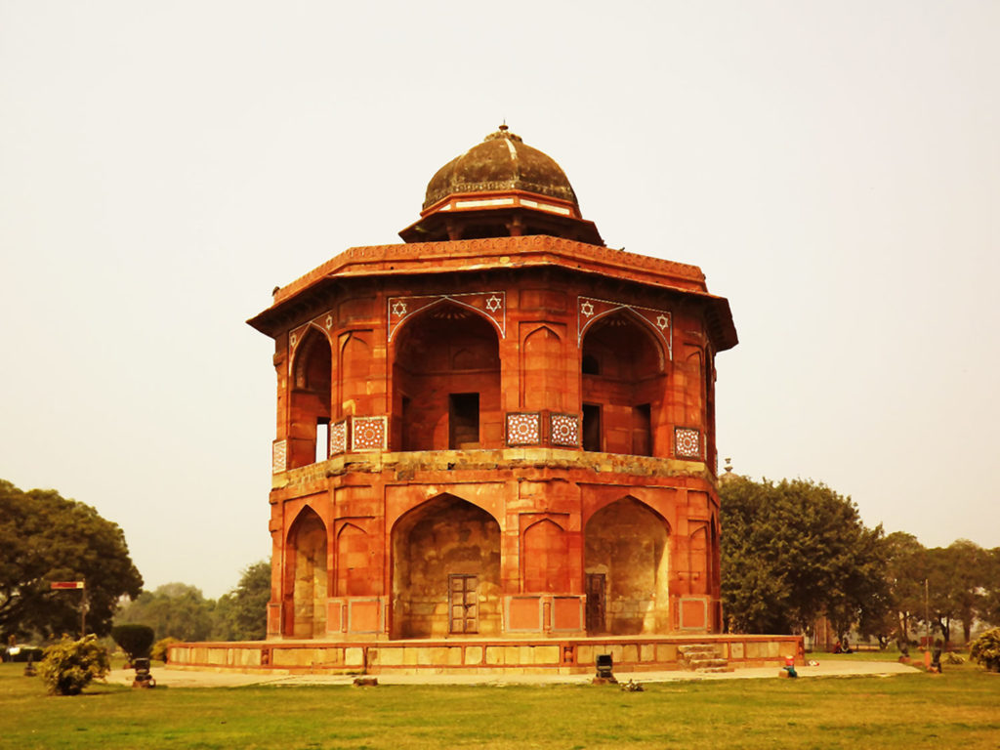
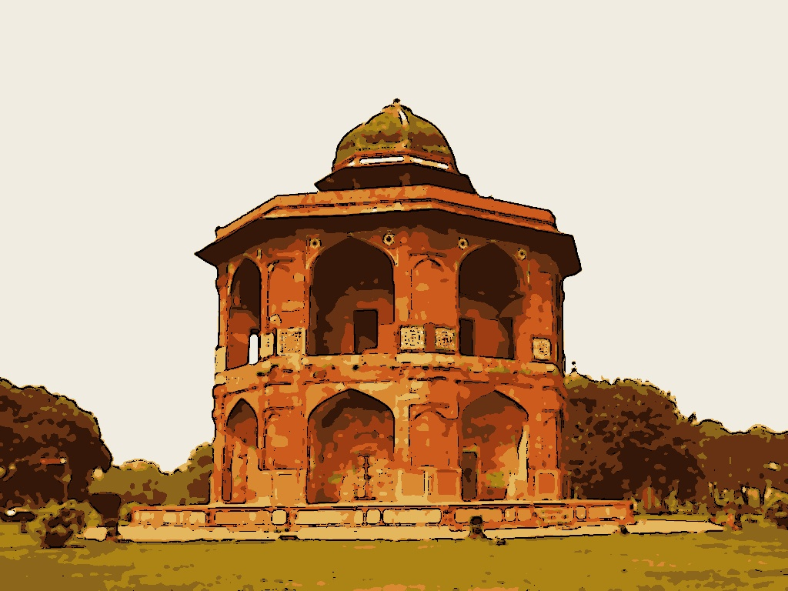

# Animefy
Photo filter made using OpenCV to toonify your Images, which is being implemented using a discord bot

### Components Included:
* An OpenCV implementation to Animate the Image
* A discord bot to integrate the Animefy function into Discord servers

### Process of the Animefying the image:
* The edges of the image are first detected, these edges are then made thicker to obtain a cartoon like look
* K-means is then used to find the colours that are close to each other, and all these colours are substituted with one colour.

### Results:

Before passing through the model:

After passing through the model:

